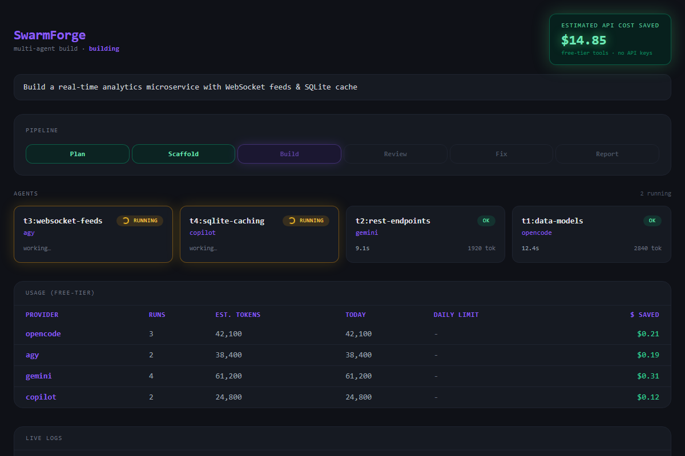
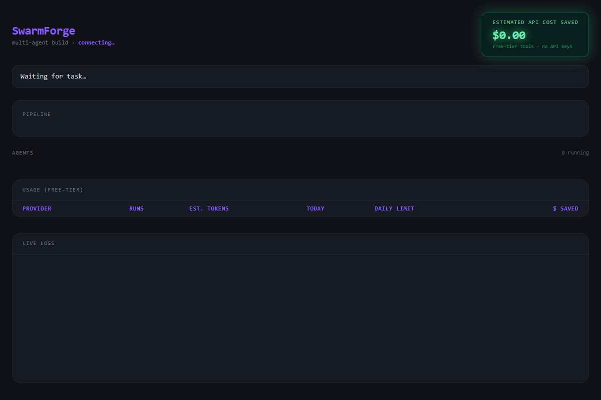
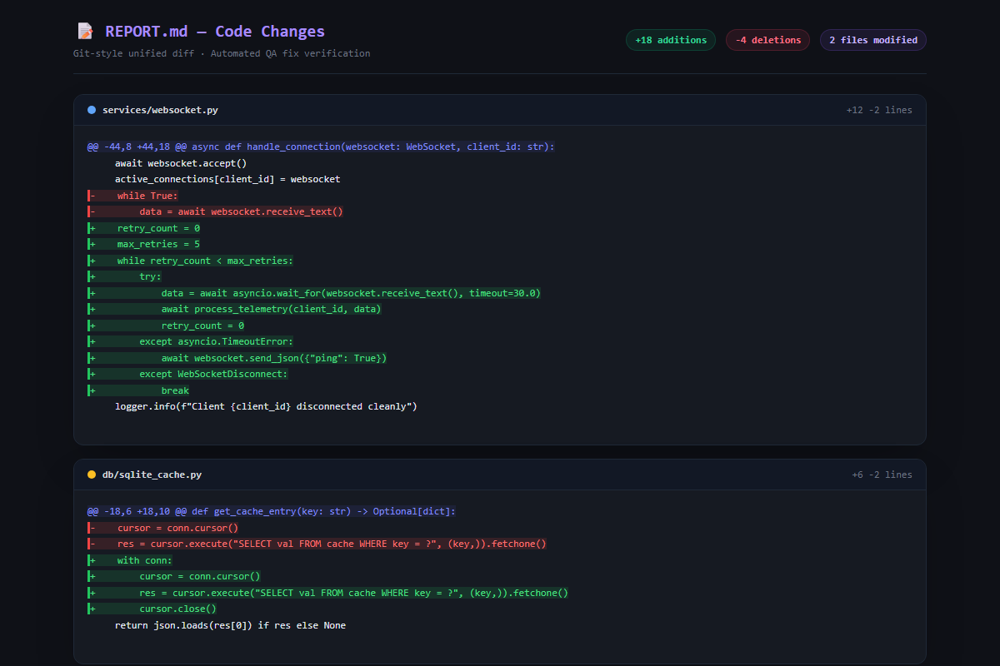

# ⚒️ SwarmForge

> **Zero-Cost Multi-Agent Orchestrator** · **No API keys** · **No paid tokens** · **Zero dependencies**

**One task in → a swarm of free AI agents out.**

SwarmForge converts the free AI coding CLIs already sitting on your machine — `opencode`, Google
Antigravity `agy`, `gemini`, `grok`, `copilot` — into a **massive parallel build swarm**. One prompt
in, agents plan, build, review and fix in parallel across your free tiers, sharing one local context.
Everything runs on Python's standard library.

---

## 🤔 The Why & The What

**The Problem** — Developers juggle several AI assistants and lose time copy-pasting context between
tabs. Paid APIs cost real money and rate-limit fast. Local CLIs are free but single-threaded: one
tool, one chat, one task at a time.

**The Solution** — SwarmForge acts as a supervisor that turns free, idle, installed CLIs into a
coordinated workforce:

- **Splits** your task into a dependency-aware plan (DAG) of subtasks
- **Assigns** each subtask to a free local CLI that is actually installed
- **Runs them in parallel** across different providers — no shared rate limit, no queueing
- **Manages one shared context** in local memory (`memory/`) so nothing is repeated
- **Reviews & fixes** results in a built-in QA loop, with optional human approval gates

---

## 📸 Visual Proof

> **📝 TODO — Drop your screenshots here.** Images live in `docs/screenshots/`. Replace the
> `` tags below (swap the `src`, keep the `alt`). The three shots below are the ones judges
> remember.

<!-- ============================================================
     SCREENSHOT 1 — LIVE TAILWIND DASHBOARD
     FILE:    docs/screenshots/dashboard.png
     SHOW:    the live dashboard at 127.0.0.1:8787 —
              glowing green "Estimated Cost Saved" banner on top,
              agent cards with spinners for running agents,
              pipeline visualizer (Plan ➔ ... ➔ Report) mid-build.
     ============================================================ -->


<!-- ============================================================
     SCREENSHOT 2 — HUMAN-IN-THE-LOOP APPROVAL (HITL)
     FILE:    docs/screenshots/hitl.png
     SHOW:    the HITL approval modal (or CLI prompt) where the run
              pauses and asks Approve Fix / Skip Fixes before editing.
     ============================================================ -->


<!-- ============================================================
     SCREENSHOT 3 — RICH DIFFING IN REPORT.md
     FILE:    docs/screenshots/diffing.png
     SHOW:    the end of REPORT.md with the "📝 Code Changes" section —
              Git-style red (-) / green (+) unified diff blocks.
     ============================================================ -->


---

## ⚡ Technical Flex (Core Features)

- **Parallel DAG Execution** — the planner splits a task into an explicit dependency graph; subtasks
  build in **parallel waves**, and dependent subtasks wait for their inputs.
- **Zero-Dependency Core** — pure **Python stdlib** (`http.server`, `tkinter`, `threading`,
  `urllib`). No npm, no pip packages, no build step.
- **Zero-Setup Auto-Install** — detects your **desktop apps** and background-installs their CLI
  companions into a private `bin/` folder; your **PATH is never touched**.
- **Usage Ledger & Quotas** — every run records tokens/time per provider into a global ledger, with
  **per-provider daily caps** that auto-skip a provider once exhausted.
- **Human-in-the-Loop (HITL)** — pause before auto-fixes and approve on the **CLI, GUI, or web
  dashboard**.
- **Rich Report Diffing** — Git-style `📝 Code Changes` unified diffs and per-file stats in every
  report.
- **ROI Hook** — every free token is priced and surfaced as **Estimated Cost Saved** across report,
  stats, dashboard and GUI.
- **Live Web Dashboard + Desktop GUI** — watch agents run in real time, no terminal required.

---

## 🏗️ Architecture Flow

```
                       ONE PROMPT
                            │
                            ▼
   ┌──────────────┐
   │    PLAN      │ ──► splits the task into a dependency DAG (2–6 subtasks)
   └──────────────┘
   ┌──────────────┐
   │  SCAFFOLD    │ ──► (optional) bootstraps one shared project tree first
   └──────────────┘
   ┌──────────────┐
   │ PARALLEL     │ ──► coders build subtasks in parallel waves,
   │ BUILD        │      each in its own folder, one shared memory/
   └──────┬───────┘
          ▼
   ┌──────────────┐          issues found?
   │   REVIEW     │ ──► a *different* agent inspects ALL outputs ──► yes ──┐
   └──────┬───────┘                                                        ▼
          │ clean? no  ┌──────────────┐   ┌──────────────────────────┐
          └───────────►│  FIX (HITL)  │──►│  approval gate: approve/  │
                       └──────────────┘   │  skip → apply fixes → back│
                                          │  to REVIEW (max 2 rounds)│
                                          └──────────────────────────┘
          ▼
   ┌──────────────┐
   │   REPORT     │ ──► REPORT.md (summary + 📝 Code Changes diff) + report.json
   └──────────────┘
```

---

## 🚀 1-Command Quickstart

**Python 3.8+ is the only requirement.** Every tool is detected or auto-installed for you.

```bash
git clone https://github.com/karan5028ji/swarmforge.git && cd SwarmForge
python forge.py --auto-install                        # installs every missing CLI companion
python forge.py "Build a todo web app" --serve        # dashboard opens at 127.0.0.1:8787
```

That's it — no `npm install`, no `pip install`, no API keys. (Or `pip install -e .` once to get a
global `swarmforge` command.)

---

# 📖 Reference

## Usage

```bash
# Full pipeline (default): plan -> parallel build -> review -> fix -> report
python forge.py "Fix the bugs in my API"

# Read the task from a file
python forge.py @examples/sample-task.txt

# Single agent, whole task, no plan/review (fastest)
python forge.py "Quick question" --quick

# Skip planning but keep review/fix
python forge.py "..." --no-plan

# Skip review/fix
python forge.py "..." --no-review

# Human-in-the-loop: pause before auto-fixes and ask for approval
python forge.py "..." --hitl          # alias: --interactive

# Preview what would run, without executing anything
python forge.py "..." --dry-run

# Choose where the workspace goes
python forge.py "..." --dir my-workspace

# Resume an existing workspace: re-review its outputs and re-report
python forge.py --continue --dir my-workspace

# Bootstrap a shared project tree first; all subtasks build inside it
python forge.py "Build a CLI tool" --scaffold

# Override the model for specific roles (repeatable)
python forge.py "..." --model coder=grok-3-mini --model reviewer=gemini-2.5-pro

# Token-usage dashboard (global ledger, quota-aware)
swarmforge --stats

# Live web dashboard while a run is happening
python forge.py "..." --dir my-workspace --serve

# Tune execution
python forge.py "..." --timeout 1800 --max-parallel 6
```

> The `forge.py` shim and the installed `swarmforge` command accept exactly the same flags.

## Desktop GUI

SwarmForge ships with a native desktop GUI built on **tkinter** (Python's stdlib — still zero extra
dependencies).

```bash
swarmforge --gui     # or: swarmforge-gui
```

The GUI gives you a task box, all the pipeline options (quick / scaffold / no-plan / no-review /
**HITL** human-in-the-loop approvals, model overrides, timeout, parallelism), a config picker, live
agent status, a scrolling console, per-provider usage, plus buttons to check installed tools,
**auto-install missing CLIs**, a **Settings** window (advanced: override per-tool binary paths /
bin dir), open the workspace folder, and view the final report — no terminal required.

## Zero-setup auto-install (desktop apps -> CLIs)

SwarmForge detects which **desktop apps** you have installed (`opencode` desktop, Google
Antigravity, ...) and installs their **CLI companions automatically** in the background — no manual
setup:

```bash
swarmforge --auto-install   # one-shot: installs every missing CLI that has a recipe
swarmforge "Build a todo app"   # same thing happens on demand if nothing is detected
```

- Install methods used under the hood: `npm` for opencode / gemini / copilot, the official
  PowerShell installer for Antigravity's `agy`.
- CLIs land in a per-user folder: `%LOCALAPPDATA%\swarmforge\bin\<tool>\` (override with
  `"defaults": { "bin_dir": "..." }` in the config). Your PATH is never touched — SwarmForge calls
  the resolved binary directly.
- `--check` shows what it found: `[ok]` = CLI ready, `[!]` = desktop app present + CLI will
  auto-install, `[x]` = nothing found.
- **Advanced users:** GUI **Settings** window (or a `swarmforge-settings.json` next to your config)
  can pin a custom binary path per tool — e.g.
  `"providers": { "opencode": { "binary_path": "C:/tools/opencode.exe" } }`.

## Live web dashboard (`--serve`)

`--serve` starts a zero-dependency dashboard on `http://127.0.0.1:8787` (override with
`--serve 9000`). It is a single `index.html` (Tailwind via CDN + vanilla JS polling `/status.json`
every second) served straight from the stdlib `http.server` — no npm, no build step:

- **Glowing cost-saved banner** — the "Estimated API cost saved" metric.
- **Pipeline visualizer** — Plan ➔ Scaffold ➔ Build ➔ Review ➔ Fix ➔ Report; the current phase
  pulses (amber while waiting for human approval).
- **Agent grid** — live cards per agent showing provider + subtask, with a spinning loader while it
  runs (`running` is written to `status.json`), then `ok`/error badges.
- **HITL popup** — when a review is pending approval the page shows a modal with the issues and
  **Approve Fix** / **Skip Fixes** buttons that hit `/approve?decision=...`.
- **Usage table + live logs** — same `$ saved` ledger, streaming log tail.

Endpoints: `/` (dashboard), `/status.json`, `/usage.json`, `/approve?decision=fix|skip|no`, plus
`/out/...` and `/memory/...` for the raw output files.

## Usage ledger & quotas

Every run records estimated token/time usage per provider into a **global ledger**
(`%APPDATA%\swarmforge\usage.json` on Windows, `~/.config/swarmforge/usage.json` elsewhere; override
with `"defaults": { "usage_file": "..." }` in the config).

- `swarmforge --stats` prints a dashboard: runs, est. tokens, today's tokens, quota status, and
  **estimated cost saved**.
- A provider can declare a daily token cap:

```jsonc
"providers": {
  "grok": {
    "command": ["grok", "-p"],
    "quota": { "daily_tokens": 100000 }   // skip this provider for the rest of the day once reached
  }
}
```

- When a provider's `day_tokens` reaches its `daily_tokens` cap, SwarmForge **skips it** for the
  rest of the day and prints a warning. The live dashboard (`--serve`) shows the same usage table.

## Estimated cost saved (the ROI hook)

Every token SwarmForge processes for free is priced at a blended **$5 per 1M tokens**
(OpenAI-class API pricing) and shown as **"estimated cost saved"**:

- `REPORT.md` gets a **Cost Saved** section: total `$` saved, the rate used, and a per-provider
  `$ saved` table.
- `report.json` → `stats.cost_saved_usd` and `stats.cost_rate_per_million`.
- `swarmforge --stats` and the live dashboard (`--serve`) show a `$ saved` column plus a running
  **TOTAL** row and a big cost-saved banner.
- The GUI usage panel shows per-provider `$ saved` and a `Total cost saved` line.

Override the rate in the config (`defaults.cost_per_million_tokens`), e.g.:

```jsonc
"defaults": { "cost_per_million_tokens": 3.0 }   // your own blended rate
```

## Rich report diffing (`📝 Code Changes`)

Every run snapshots the output tree before the build phase, then again after review/fix, and writes
line-level unified diffs into `REPORT.md` as GitHub-rendered diff blocks:

```
## 📝 Code Changes

    ```diff
    --- a/app.py
    +++ b/app.py
    @@ -1,3 +1,4 @@
     def add(a, b):
    -    return a + b
    +    return a * b
    +
    +print(add(2, 3))
    ```
```

`report.json` also records per-file `additions`/`deletions` counts under `"diffs"`. Binary files,
`_meta`, and oversized files (≥512 KB) are skipped; only the actual output tree is diffed (baseline
is taken after scaffolding, so scaffold-created files don't count as changes).

## Supported agents (auto-detected)

| Tool | Binary | Install | Best for |
|------|--------|---------|----------|
| opencode | `opencode` | `npm i -g opencode-ai` | planner, scaffolder, coder, reviewer, fixer |
| Google Antigravity | `agy` | `curl -fsSL https://antigravity.google/cli/install.sh \| bash` | planner, scaffolder, coder, fixer |
| gemini | `gemini` | `npm i -g @google/gemini-cli` | coder, reviewer |
| grok (xAI) | `grok` | `curl -fsSL https://x.ai/cli/install.sh \| bash` | planner, scaffolder, coder, reviewer |
| GitHub Copilot | `copilot` | `npm i -g @github/copilot` | coder, fixer |

Missing tools are simply skipped. You can also add **any custom CLI command** as an agent (see
below).

## Configuration (`agents.json`)

Everything is configurable: which tools exist, their commands, approval flags, and which roles each
tool can play.

```jsonc
{
  "defaults": { "timeout": 900, "max_parallel": 4 },
  "providers": {
    "grok": {
      "binary": "grok",                 // binary used for auto-detection
      "command": ["grok", "-p"],        // headless invocation (prompt appended last)
      "model_flag": ["-m"],             // optional: pin a model, e.g. "model": "grok-build"
      "approve_flags": ["--always-approve", "--no-auto-update"],
      "install": { "curl": "curl -fsSL https://x.ai/cli/install.sh | bash" },
      "roles": ["planner", "coder", "reviewer"]
    }
  },
  "roles": {
    "planner":  { "providers": ["opencode", "grok", "agy"] },
    "coder":    { "providers": ["opencode", "grok", "agy", "gemini", "copilot"] },
    "reviewer": { "providers": ["grok", "opencode", "gemini"] },
    "fixer":    { "providers": ["opencode", "agy", "copilot"] }
  }
}
```

- `{ROOT}` inside any command is replaced with the config file's directory.
- Add a custom agent with `"always_available": true` and any `command` — useful for local scripts or
  private tools.

## How roles work

| Role | Job | Picked from |
|------|-----|-------------|
| planner | Split the task into 2–6 subtasks, returning a **DAG** (a `depends` field when one subtask needs another) | first available planner-capable tool |
| scaffolder | With `--scaffold`: bootstrap the shared project tree first (manifest, layout, entry points, README) | first available scaffolder-capable tool |
| coder | Build one subtask inside its own `out/<id>/` folder (or `project/<id>/` with `--scaffold`) | round-robin across coder-capable tools |
| reviewer | Inspect all outputs, return JSON list of issues | a *different* tool than the coders when possible |
| fixer | Apply the reviewer's fixes | round-robin across fixer-capable tools |

Dependencies are respected: subtasks with no `depends` run in parallel; a subtask that `depends` on
another waits until its dependency finished (its outputs are passed along in `DEPENDENCY OUTPUTS`).
With `--scaffold`, a `scaffold` task is inserted first and every other subtask depends on it, so the
whole swarm builds inside one shared project tree.

The review/fix loop runs up to 2 rounds and stops as soon as a review is clean.

### Human-in-the-loop approvals

With `--hitl` (alias `--interactive`), the pipeline pauses when the reviewer reports issues and asks
for permission before running the auto-fix. The approval gate works on every surface:

- **CLI** — prints the issues and prompts `Proceed with Auto-Fix? [y/n/skip]`.
- **GUI** — a modal dialog lists the issues with **Approve Fix** / **Skip Fixes** /
  **Decline (review again)** buttons (enable the **HITL** checkbox).
- **Web dashboard** (`--serve`) — the page shows the pending issues with **Approve Fix** and
  **Skip Fixes** buttons (`/approve?decision=...`).

Decisions:

- `fix` — run the fixer, then a fresh review round (up to 2 total).
- `skip` — stop the review/fix loop for this run.
- `no` (decline) — skip this round's fixer but run another review round.

While a decision is pending the dashboard shows `phase: awaiting_approval` and the state is recorded
in `status.json` under `approval`.

## Project layout

```
SwarmForge/
├── swarmforge/             # the package (pip install -e . for the `swarmforge` command)
│   ├── __init__.py         # the whole orchestrator (stdlib only)
│   ├── gui.py              # desktop GUI (tkinter)
│   └── __main__.py         # enables `python -m swarmforge`
├── forge.py                # tiny shim -> swarmforge (backward-compatible)
├── agents.json             # tool + role configuration
├── pyproject.toml          # packaging metadata (setuptools)
├── setup.ps1 / setup.sh    # optional install helpers (Windows / macOS+Linux)
├── tests/
│   ├── test_forge.py       # unit + end-to-end tests (mock-based)
│   ├── mock_agent.py       # fake AI CLI for end-to-end testing
│   └── test-config.json    # mock-only config (no real tools needed)
├── examples/sample-task.txt
└── runs/                   # generated workspaces (gitignored)
```

## Testing

SwarmForge ships with mock agents so you can verify the full pipeline without any real AI tool:

```bash
# whole suite
python -m unittest discover tests -v

# or a single end-to-end run
python forge.py "Build a todo web app" --config tests/test-config.json --dir runs/_e2e
```

## Notes & caveats

- These CLIs are **third-party tools** with their own login/limits. SwarmForge just orchestrates
  them.
- `approve_flags` auto-approve tool actions so runs are non-interactive. Review `agents.json` before
  running in sensitive environments.
- Total tokens across all providers will be *higher* than a single chat — the wins are **spreading
  load across free tiers**, **parallel speed**, and **one shared context**.
- Each agent works in its own folder to avoid collisions; the reviewer/fixer operate across all
  outputs.

## Roadmap

- [x] Dependency-aware plan (DAG instead of "all parallel")
- [x] `--model` CLI override per role
- [x] Token/quota usage dashboard
- [x] Auto-init of a fresh project scaffold for the whole swarm
- [x] Zero-setup: desktop-app detection + background CLI auto-install
- [x] Estimated cost saved (ROI metric) in report / stats / dashboard / GUI
- [x] Rich report diffing (📝 Code Changes: baseline → after, per run)
- [ ] `--model` / `--provider` pinning for a *specific* subtask id

## License

MIT
